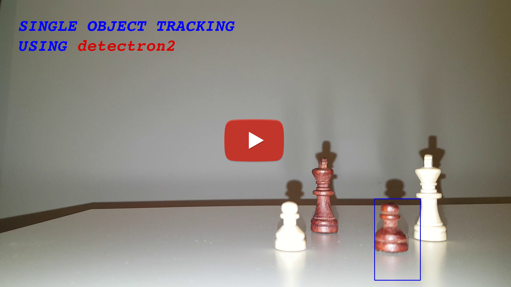

# detectron2-sot

## Introduction

[](http://www.youtube.com/watch?v=AjA-RN_Db9w)

This repository demonstrates construction of a Single Object Tracker (SOT) using the [detectron2](https://github.com/facebookresearch/detectron2) framework. We mainly reuse the Anchor generation part and rewrite the RPN network to suit Object tracking.


The code is based on the [SiamFC](https://arxiv.org/pdf/1606.09549.pdf), [SiamRPN](http://openaccess.thecvf.com/content_cvpr_2018/papers/Li_High_Performance_Visual_CVPR_2018_paper.pdf), [SiamRPN++](https://arxiv.org/pdf/1812.11703.pdf) papers. Credit also goes to the [pysot](https://github.com/STVIR/pysot) repository which is an excellent resource for single object tracking in general (doesn't use the detectron2 framework)


## Dataset

We use the [COCO2017](http://cocodataset.org/#home) dataset to train. We prepare the dataset in the same way as [pysot](). Refer tp their data preparation [here](https://github.com/STVIR/pysot/tree/master/training_dataset/coco)

## Train

To train, adjust the [COCODataset](dsot/dataset.py) init parameters and simply run using

```python dsot/train.py```

Training for 20 epochs already results ina  good model (refer video), training futher should result in better results. Additionally data from other datasets like Youtube Video dataste could be added to futher improve accuracy


## TODO

- [ ] Move config to yaml
- [ ] Add inferencer from private repo
- [ ] Add improvements from SiamRPN++ to improve accuracy